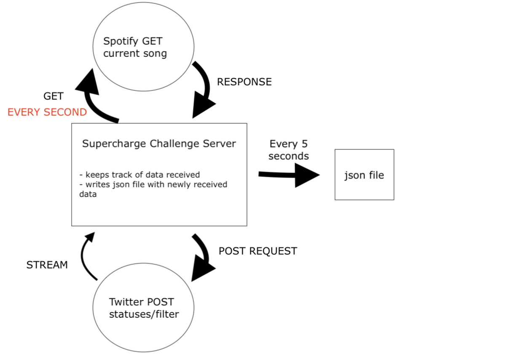

# Backend Engineering Challenge

Thank you for your interest in the Supercharged Software Engineer team! This project gives us a chance to see your Backend engineering programming skills.

Please complete this challenge and make your repository accessible to:

- [iamsupercharged](https://github.com/iamsupercharged) (rayan@supercharged.gg)

**Small Backend making use of the Twitter API**

You should develop a backend service (with the framework of your choice) composed of the following: 
- One route to start action 
- Two different code parts that communicate with the Twitter API according to endpoint fetched
- Method that writes gathered data to a json file every 5 seconds (once one user's timeline has been written, move to next account to fetch profile)

Use the Twitter API to fetch sequentially (one by one) 5 different profile's statuses with the following endpoint:
-  [GET statuses/timeline](https://developer.twitter.com/en/docs/tweets/timelines/api-reference/get-statuses-user_timeline)

Twitter profiles we like (you can choose your own too) :
	@elonmusk
	@naval
	@reidhoffman
	@ninja
	@wendys

You should make use of the following endpoints to listen to the real-time tweets from @realDonaldTrump:
- [POST statuses/filter](https://developer.twitter.com/en/docs/tweets/filter-realtime/api-reference/post-statuses-filter)

Aggregate the twitter notifications with the fetched timeline and only write them in a JSON file every 5 seconds. Then move to the next twitter profile and aggregate it with donaldtrump's stream for another JSON file. This action should stop once it has finished fetching each profile and created 5 different JSON files. 

##Implementation in AWS##
Think about how you would organize this project's architecture in AWS, if data was not written in JSON but rather sent through webhooks. A simple drawing of your different AWS components will work.

## Other Tips

- You have the freedom to use any third-party library 
- Think about how this could be done while many users would be fetching different twitter accounts. So better avoid global variables. 
- You do not need to write a front-end for this project, postman will work. 
- The goal of the exercise is to showcase not only your ability to write code but also think of scalability. 
