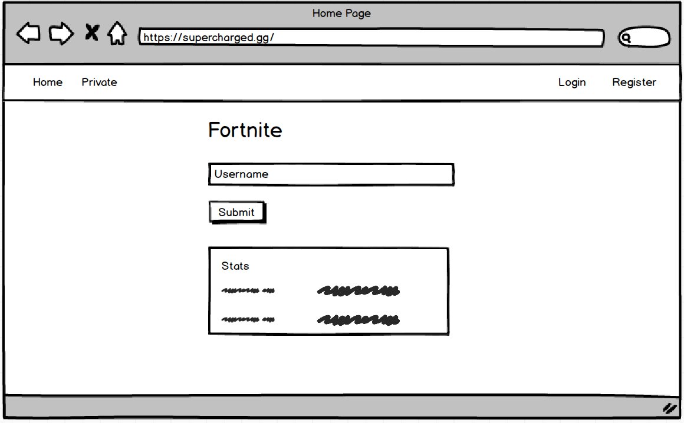
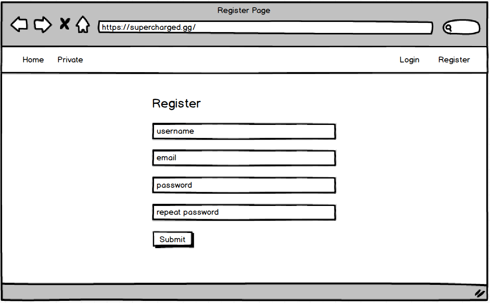
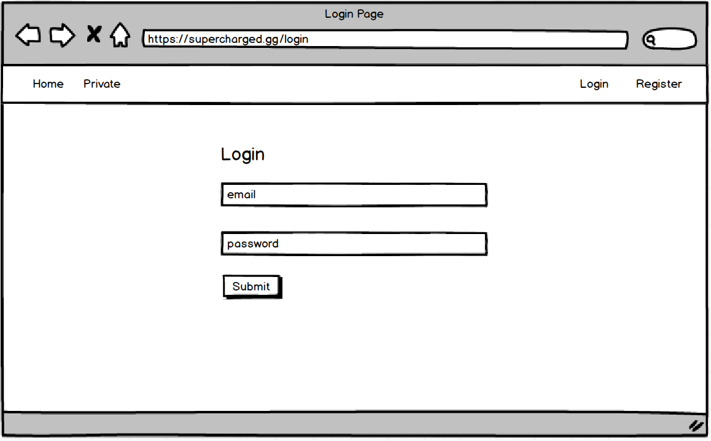
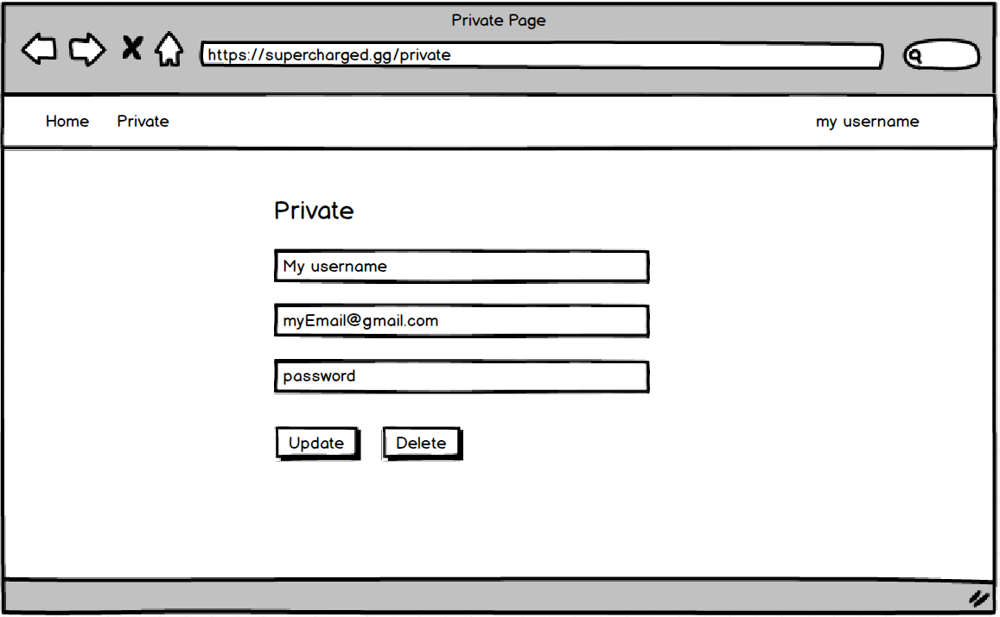

# Supercharged Gaming Challenge

## Introduction

Thank you for your interest in the Supercharge Software Engineer team! This project gives us a chance to see your Javascript programming skills.

Please complete this challenge and make your repository accessible to:

- [iamsupercharged](https://github.com/iamsupercharged) (rayan@supercharged.gg)

## Instructions

- Implement your own react/redux envirionment using Webpack 4 and babel 7
- Implement the user stories and wireframes 
- While it is not required to use a backend, you can try simulating the communication with a backend using a setTimeout 
- Use a Fortnite Api to fetch user info by username
- Happy hacking !

> If you have any questions or want some clarifications feel free to contact us. 

## Technological requirements
- React 
- Redux
- Webpack 4
- Babel

## User stories

- As a user I can register
- As a user I can log-in
 - If I logged-in and then leave the page, I should be automatically logged in when re-visiting. 
- As a user I am able to access the /private route only if logged in (or redirected to login page)
- As a user I can enter a fortnite username and get the username's stats in the home page
- As  a user I can update my account information in /private
- As a user I can delete my account in /private

> **!important** Use the redux store 

## Wireframes

### Home Page

### Register Page

### Login Page

### Private Page

